# Macro Content in Food Related to Price Changes Project

## Overview
This project investigates how the macronutrient composition of foods—specifically protein, carbohydrates, and fats—relates to changes in food prices over time. Our goal is to understand the cost-efficiency of nutrients and predict which foods may experience price fluctuations in the future. 

The research focuses on U.S. food pricing trends and analyzes cost per calorie and cost per gram of different foods. The study is motivated by the authors' interest in nutrition and fitness, with an emphasis on affordable sources of macros.

## Authors
- Ivan Gorodinski – ivgo5040@colorado.edu
- Rodolfo Martinez-Maldanado – roma7649@colorado.edu
- Giovanni Palazzolo – gipa9573@colorado.edu

All authors contributed equally to this research.

## Data Sources
- **U.S. Bureau of Labor Statistics (BLS)** – Average Retail Food and Energy Prices, U.S. City Average and West Region.
- **USDA Economic Research Service (ERS)** – Food-at-Home Monthly Area Prices.
- **USDA FoodData Central (ARS)** – Macronutrient composition data.

## Methodology
1. **Data Preprocessing**
   - Imputed missing values using PyTorch-based regression models.
   - Normalized data for time-series analysis.
   - Filtered datasets to focus on relevant macronutrients.

2. **Data Analysis**
   - Examined cost per 1000 calories for protein, fats, and carbohydrates.
   - Performed correlation analysis between nutrient content and price trends.
   - Created linear graphs and time-series visualizations.

3. **Modeling**
   - Built regression models for missing value imputation and trend prediction.
   - Analyzed historical data to identify patterns in price fluctuations.

## Key Findings
- Protein-rich and fat-rich foods experienced higher price volatility compared to carbohydrate-rich foods.
- Carbohydrate-dense foods such as grains remained more stable in price.
- Macronutrient composition significantly influences long-term food price trends.
- Fat provides the highest nutrient value per dollar, while protein is more expensive per unit of nutrition.

## Tools
- Python (Pandas, Matplotlib, Seaborn)
- PyTorch for regression and missing value imputation
- GitHub for data version control and collaboration

## Figures
- Normalized average food prices over time
- Average protein content in foods over time
- Average fat content in foods over time
- Average price per 1000 calories by macronutrient

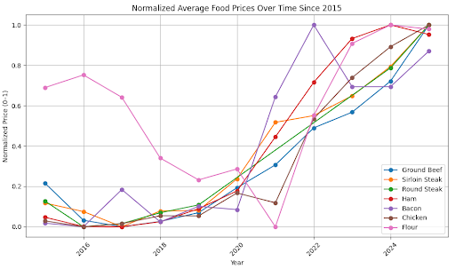
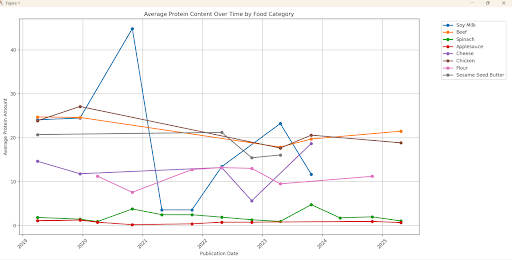
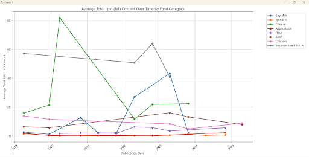
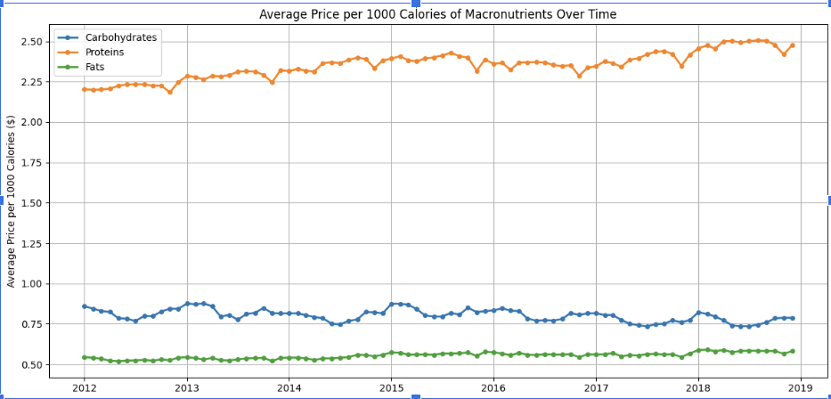

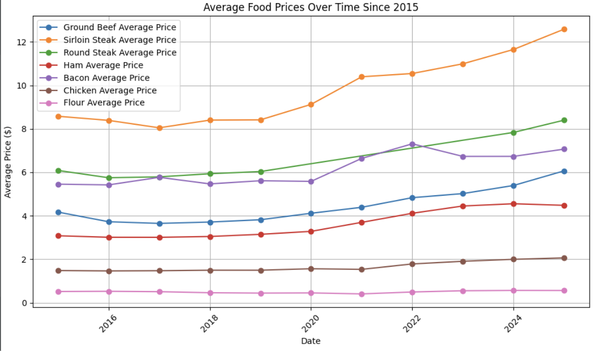
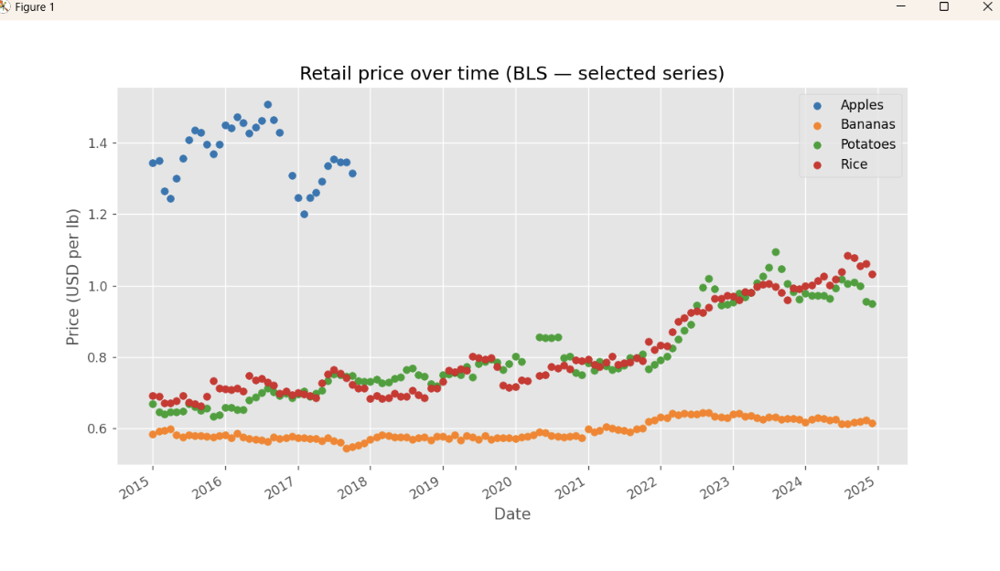
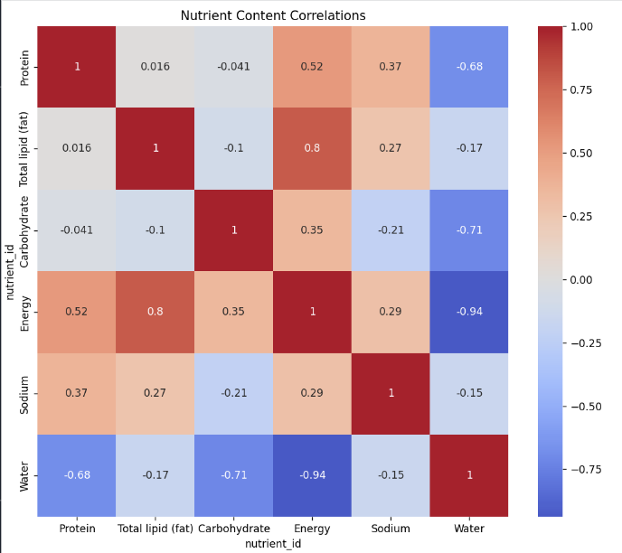
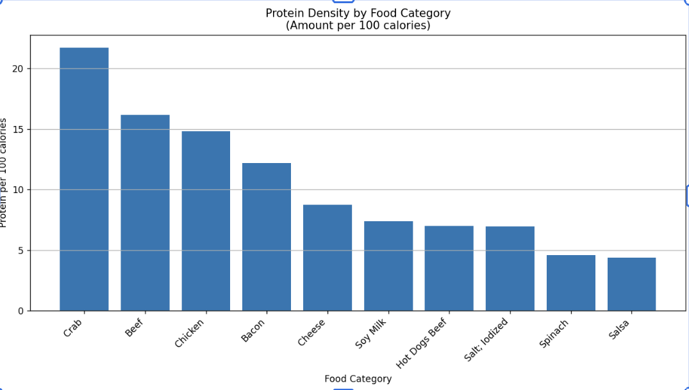
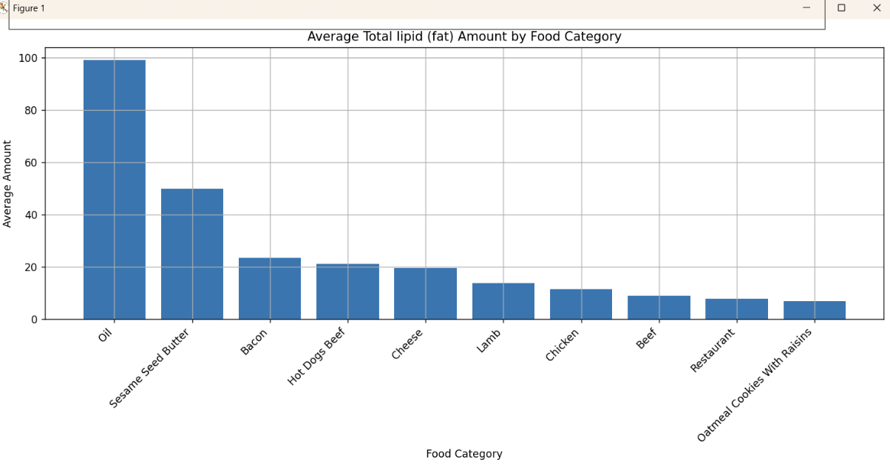
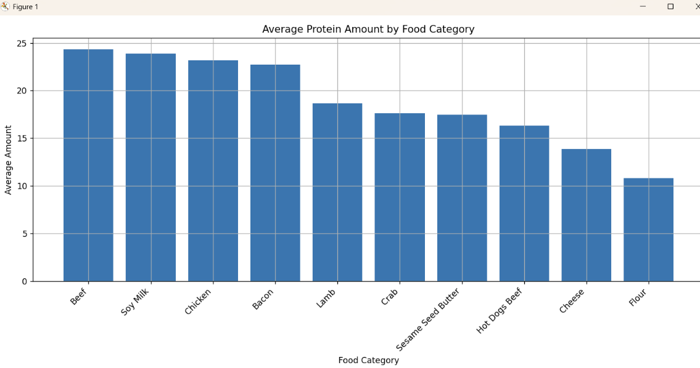
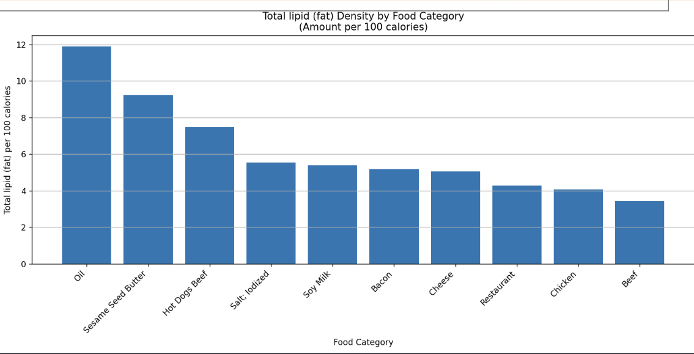

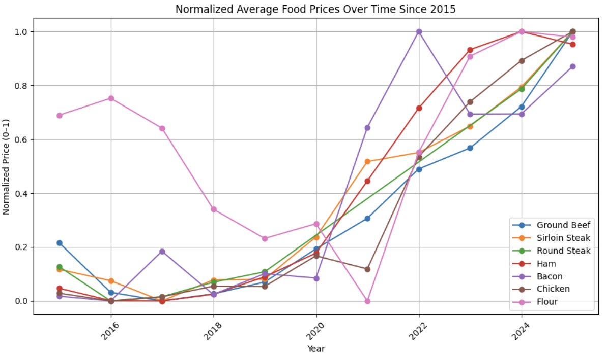
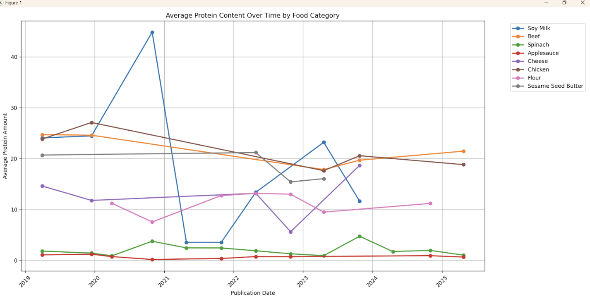
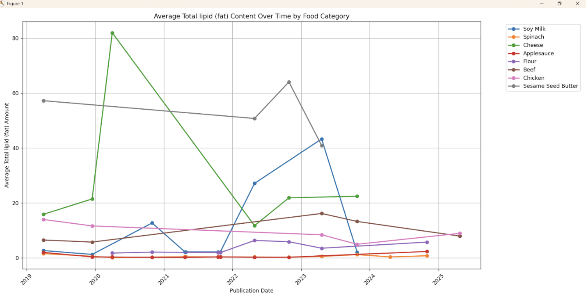
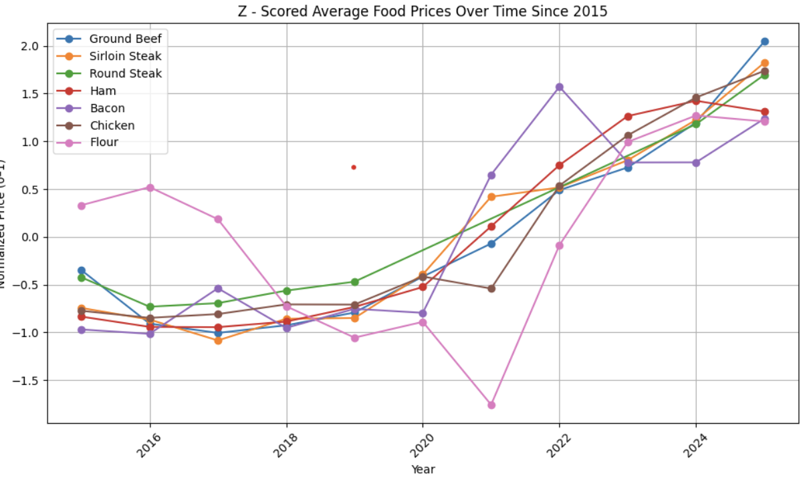
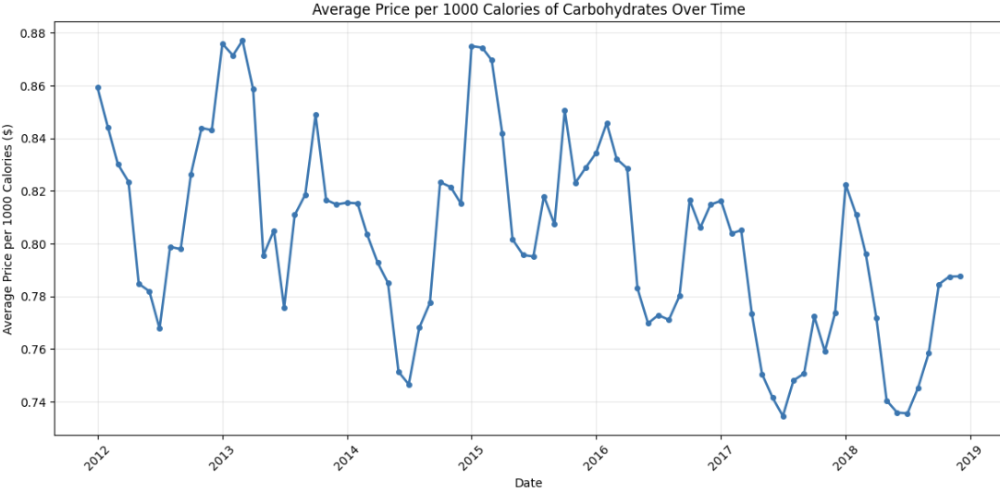
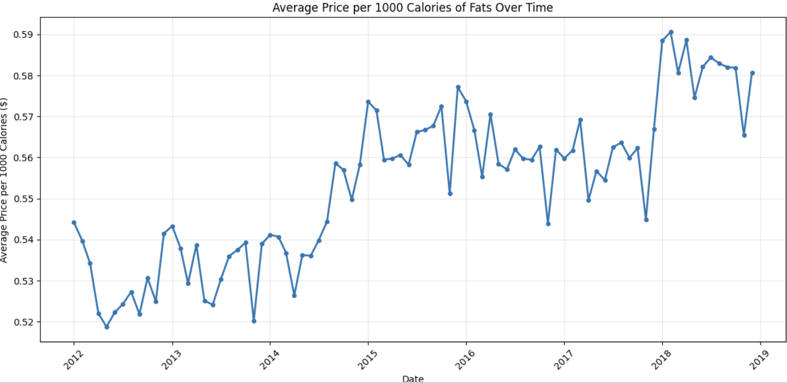
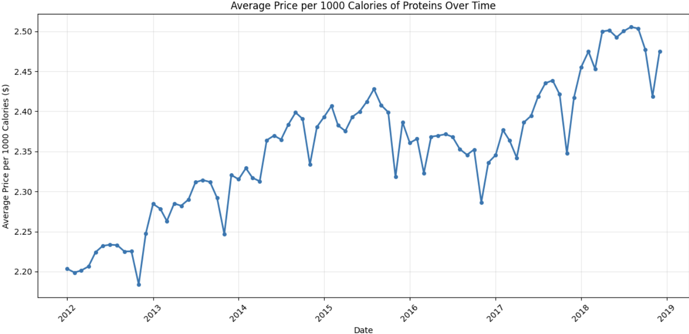

## Code to Run Files and Outputs Continued
1. python3 bacon_ML.py

Predictions for missing 2025 months:
Jan: 7.1857
Feb: 6.9516
Mar: 7.1523
Apr: 7.1692
May: 7.1373
Jun: 7.0947
Jul: 7.2484
Aug: 7.1789
Sep: 7.4108
Oct: 7.8480
Nov: 6.5191
Dec: 6.7332

2. python3 beef_ML.py

Predictions for missing 2025 months:
Jan: 5.5320
Feb: 5.5898
Mar: 5.6875
Apr: 5.7886
May: 5.7827
Jun: 6.0288
Jul: 6.0295
Aug: 6.2202
Sep: 6.2806
Oct: 6.0034
Nov: 6.0187
Dec: 5.9789

## References
1. [USDA Food Price Outlook](https://www.ers.usda.gov/data-products/food-price-outlook/summary-findings)
2. [Fox News: Food Prices Surge](https://www.fox13news.com/news/food-prices-expected-surge-experts-say-somethings-got-change)
3. [CBS News: Shrinkflation](https://www.cbsnews.com/news/rising-grocery-prices-could-lead-to-shrinkflation-food-industry-analyst-says/)
4. [Journey Foods: Dealing with Shrinkflation](https://www.journeyfoods.io/blog/dealing-with-shrinkflation)
5. [SpringerOpen: Long-term prices of micronutrient-dense foods](https://agrifoodecon.springeropen.com/articles/10.1186/s40100-022-00232-9)
6. [PubMed Central: Poverty and Obesity](https://pmc.ncbi.nlm.nih.gov/articles/PMC2954450/)
7. [BLS Average Retail Food and Energy Prices](https://www.bls.gov/regions/mid-atlantic/data/averageretailfoodandenergyprices_usandwest_table.htm)
8. [USDA Food-at-Home Monthly Area Prices](https://www.ers.usda.gov/data-products/food-at-home-monthly-area-prices)
9. [USDA FoodData Central](https://fdc.nal.usda.gov/download-datasets)

## Honor Code
All team members adhered to the University of Colorado Boulder Honor Code.
